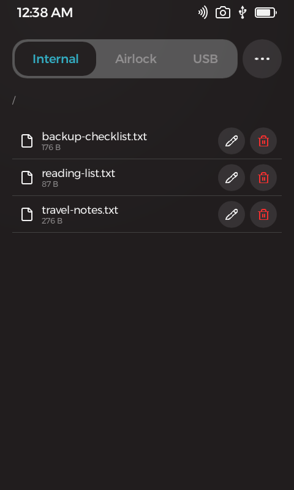
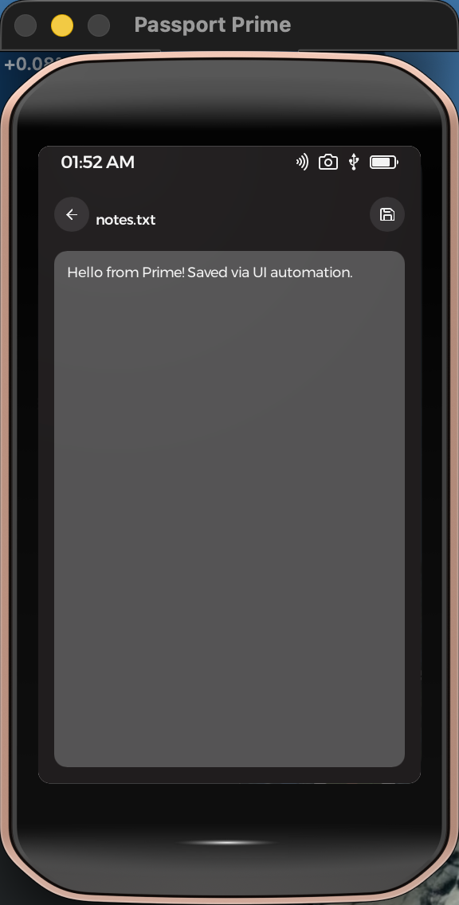

#  Text Editor

**Productivity · Files** — browse your Passport Prime's storage and edit text files, right on the device.

Your Prime carries files — recovery notes, configuration, exported records. Text Editor lets you read and change them without ever plugging into a computer: browse Internal, Airlock, and USB storage in a familiar Files-style view, tap a file to open it, edit with the on-screen keyboard, and save. Everything happens on the device, offline, the way Prime is designed to work.

<p align="center">
  
  &nbsp;&nbsp;
  
</p>

## Features

- **All three storage locations** — Internal, Airlock, and USB, switchable with one tap, with full folder navigation.
- **Open, edit, save** — a full-screen, scrollable editor that keeps your text visible above the on-screen keyboard.
- **Organize** — create files and folders, rename, and delete from a Files-app-style **•••** menu and per-row actions.
- **Show or hide hidden files** whenever you need to see everything.
- **Safe with your data** — files that aren't text are detected and reported instead of being opened as garbage, and deletes ask for confirmation.
- **Offline by design** — Prime has no network stack; nothing you write ever leaves the device unless you move it yourself.

## Get it running

With the Foundation SDK installed, build and launch in the simulator with:

```bash
foundation sim
```

See **[DEVELOPMENT.md](DEVELOPMENT.md)** for environment setup, hardware builds, permissions, and the project tour.

## Learn more

- [DEVELOPMENT.md](DEVELOPMENT.md) — building, running, permissions, and project layout
- [THIRD-PARTY.md](THIRD-PARTY.md) — libraries this app is built on
- [NOTES.md](NOTES.md) — verified build/run results and platform gotchas

## Support

If this app is useful to you, a small bitcoin donation is always appreciated — entirely optional.

<div align="center">


**`bc1qrfagrsfrm8erdsmrku3fgq5yc573zyp2q3uje8`**

</div>

Donations help cover development costs and keep more open-source bitcoin tools coming. No VC funding, no ads, no tracking.

## License & disclaimer

Licensed under the GNU General Public License v3.0 or later — see [COPYING](COPYING).

This software is provided "as is", without warranty of any kind, express or
implied. Use it at your own risk — to the maximum extent permitted by law, the
authors, copyright holders, and contributors are not liable for any claim,
damages, or other liability, including loss of data, arising from this
software or its use.
