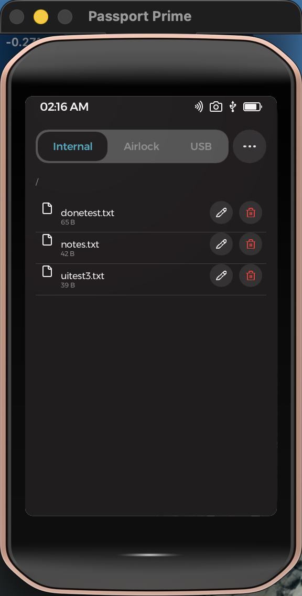

#  Text Editor — a Passport Prime app

A Files-app-style browser and text editor for Foundation's **Passport Prime**,
built as a Rust binary with a **Slint** UI on **KeyOS** (Foundation's Rust
microkernel on Xous). Browse the device's storage and open, edit, save, create,
rename, and delete text files.

<p align="center">
  
  &nbsp;&nbsp;
  
</p>

## Features

- **Three storage locations** via a segmented tab bar — **Internal**
  (`Location::User`), **Airlock**, and **USB** — plus folder navigation.
- **Open / edit / save** text files. The editor is scrollable, fills the screen,
  and shrinks above the on-screen keyboard so your content stays visible.
- **Create** new files and folders, **rename**, and **delete** — from a Files-app
  style **•••** menu and per-row actions.
- **Show/hide hidden files** (dot-prefixed) from the menu.
- Non-UTF-8 files are detected and reported rather than opened as garbage.

Everything runs offline — Prime has no network stack by design; all I/O is
through the KeyOS `fs` API.

## Build & run

Requires the `foundation` CLI (on `PATH` at `~/.foundation/sdk/bin`) and Nix.
In a non-login shell, source Nix first:

```bash
. '/nix/var/nix/profiles/default/etc/profile.d/nix-daemon.sh'
export PATH="$HOME/.foundation/sdk/bin:$PATH"
```

Then, from this directory (via the SDK's Nix dev shell):

```bash
nix develop ~/.foundation/sdk/current --command foundation sim     # hosted simulator
nix develop ~/.foundation/sdk/current --command foundation build   # compile + sign a hardware bundle
```

`foundation sim` is the primary feedback loop (it runs `cargo check` and launches
the 480×800 simulator). `foundation doctor` checks the environment.

> **Hardware sideload** (`foundation sideload`) is **not** possible on a retail
> Prime — the `PRIME` USB dev volume is compiled out of production firmware. It
> needs dev/debug firmware from Foundation. See `NOTES.md`.

## Permissions

Declared in `app-config.toml` → `[permissions]`:
`template = ["gui-app", "fs-generic", "fs-access"]` — UI + read/write filesystem
ops + per-location (`User`/`Airlock`/`USB`) read/write access grants. Enforced at
compile time (undeclared calls fail to build) and by the KeyOS kernel at runtime.

## Project layout

- `app-config.toml` / `permission_templates.toml` — hand-edited config and named
  permission bundles (`manifest.toml` is generated from them; don't hand-edit).
- `ui/app.slint`, `ui/callbacks.slint` — the UI and the Slint↔Rust bridge.
- `src/main.rs` — app logic (filesystem via the app-provided `cx.fs` handle).
- `src/theme.rs`, `theme/theme.json` — theming.

See **`CLAUDE.md`** for architecture detail and **`NOTES.md`** for build/verify
notes and the non-obvious gotchas found while building this (e.g. the SDK
`IconButton` tap bug, overlay nesting, the on-screen-keyboard behavior).

## Notes

Scaffolded from `foundation new prime-text-editor --template default-app`, then
customized. Normally checked out as a git submodule of a `prime/` workspace
(alongside a local KeyOS docs knowledge base); it also builds standalone.
Verified building (signed) and running in the simulator — see `NOTES.md`.
